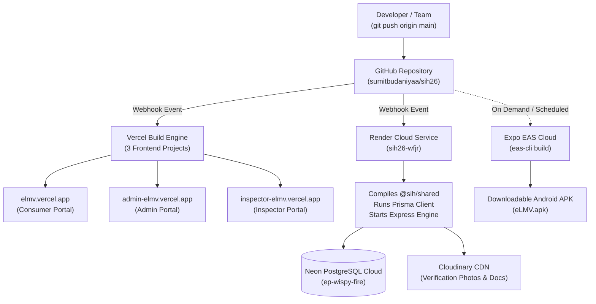

# eLMV — Online Verification System for Weighing & Measuring Instruments

Unified statutory verification, certification, and regulatory tracking system under India's **Legal Metrology Act, 2009** (Act No. 1 of 2010) and **Legal Metrology (General) Rules, 2011**.

[](https://elmv.vercel.app)
[](https://sih26-wfjr.onrender.com/health)
[](https://neon.tech)
[](https://expo.dev/accounts/sumitbudaniya/projects/elmv/builds/8baa9ca1-0f51-42c0-9c47-8ae72baf12cc)

---

## 🌐 Live Production Deployments

All portals, services, and apps are hosted in cloud production with automated CI/CD synchronization:

| Component | Target Users | Live Cloud URL | Platform |
| :--- | :--- | :--- | :---: |
| **Consumer & Trader Portal** | Citizens, Shopkeepers, Commercial Traders | **[https://elmv.vercel.app](https://elmv.vercel.app)** | Vercel |
| **Admin Management Portal** | State Controllers, Legal Metrology Directors, GATC Admin | **[https://admin-elmv.vercel.app](https://admin-elmv.vercel.app)** | Vercel |
| **Field Inspection Suite** | Legal Metrology Officers (LMOs), Field Inspectors | **[https://inspector-elmv.vercel.app](https://inspector-elmv.vercel.app)** | Vercel |
| **Public Certificate Verification** | Any Citizen scanning physical QR code stamps | **[https://elmv.vercel.app/verify](https://elmv.vercel.app/verify)** | Vercel |
| **Backend REST API** | Core Business Logic, PKI Signing, Auth | **[https://sih26-wfjr.onrender.com/api/v1](https://sih26-wfjr.onrender.com/api/v1)** | Render |
| **Server Health Check** | 24/7 Uptime Monitoring Endpoint | **[https://sih26-wfjr.onrender.com/health](https://sih26-wfjr.onrender.com/health)** | Render |
| **Mobile Android App (APK)** | On-ground Officers & Mobile Field Inspectors | **[Download APK v1.0.0](https://expo.dev/accounts/sumitbudaniya/projects/elmv/builds/8baa9ca1-0f51-42c0-9c47-8ae72baf12cc)** | Expo EAS |

---

## 🔑 Pre-Seeded Test Credentials

All environments are pre-seeded with sample statutory data and active operational roles:

| Persona | Email | Password | Access / Role |
| :--- | :--- | :--- | :--- |
| **State Admin** | `admin@metrology.gov.in` | `Password@123` | Department-wide oversight, agency approvals, officer workload, audit logs |
| **Field Officer (LMO)** | `lmo1@metrology.gov.in` | `Password@123` | On-site inspections, tolerance tests, stamping, certificate issuance |
| **Field Officer (Bengaluru)** | `lmo.bangalore@metrology.gov.in` | `Password@123` | Urban zone enforcement officer |
| **GATC Testing Lab** | `gatc.lead@precisionlab.org` | `Password@123` | Accredited testing & calibration bench |
| **Registered Trader** | `trader.rajesh@shreestores.com` | `Password@123` | Commercial shopkeeper instrument verification & applications |
| **Public Citizen** | *No Login Required* | — | Public verification at `/verify` or scanning stamp QR code |

---

## 🔄 GitHub CI/CD & Automated Cloud Synchronization

This repository uses a modern GitOps continuous deployment pipeline. **Every commit pushed to the `main` branch automatically triggers synchronized builds across all platforms**:



### How to Monitor Deployments in GitHub:
1. **Commit Status Icons**: Look at the commit history on GitHub. A green checkmark (`✔`) or yellow dot (`●`) next to any commit displays the live status of the Vercel and Render deployments.
2. **Deployments Tab**: On the right sidebar of your GitHub repository, click **"Deployments"** to view live deployment history, build times, and active URLs.
3. **Webhooks**: Go to **Settings** → **Webhooks** to see live webhook payloads sent to Vercel and Render on every push.

---

## 📦 How to Create a GitHub Release for the Android APK

To attach your generated `.apk` file directly to your GitHub repository so judges and users can download it straight from GitHub:

1. **Download the APK** to your computer:
   * Open **[Expo Build Artifact #8baa9ca1](https://expo.dev/accounts/sumitbudaniya/projects/elmv/builds/8baa9ca1-0f51-42c0-9c47-8ae72baf12cc)** and click **"Download"**.
2. **Go to Releases in GitHub**:
   * Navigate to your repo: `https://github.com/sumitbudaniyaa/sih26/releases`.
   * Click **"Draft a new release"**.
3. **Fill in the Release Details**:
   * **Tag version**: `v1.0.0` (Click *"Create new tag: v1.0.0 on publish"*).
   * **Release title**: `eLMV Mobile App v1.0.0 (Production Release)`
   * **Description**:
     ```markdown
     ### Official eLMV Android Mobile Application (Release v1.0.0)
     - Full offline and online statutory verification suite
     - Integrated camera QR scanner for physical stamps
     - Direct cloud sync with Legal Metrology Central Backend
     ```
4. **Attach the APK**:
   * Drag & drop the downloaded `.apk` file into the **"Attach binaries by dropping them here or selecting them"** box.
5. Click **"Publish release"**.

---

## 🏛️ System Architecture & Legal Metrology Compliance

```
/
├── shared/                  # @sih/shared: Zod schemas, TypeScript types, statutory formulas
├── server/                  # @sih/server: Express REST API, Prisma ORM, ECDSA PKI engine
│   ├── prisma/              # PostgreSQL schema with multi-tenant statutory models
│   └── src/                 # Controllers, services, authentication, and statutory modules
├── client/                  # @sih/client: React 18, Vite, Tailwind CSS, Lucide icons
│   └── src/
│       ├── portals/consumer # Citizen & Trader self-service portal
│       ├── portals/admin    # Controller & Regulatory governance dashboard
│       └── portals/field    # Field Officer mobile-responsive inspection suite
└── mobile/                  # @sih/mobile: React Native / Expo field enforcement application
    ├── src/                 # Camera inspection HUD, offline queue, certificate viewer
    └── eas.json             # EAS cloud build configuration for standalone APKs
```

### Statutory Core Features:
1. **Asymmetric PKI Digital Signatures (ECDSA NIST P-256 / SHA-256)**: Every certificate is signed using hardware-isolated elliptic curve keys with deterministic JSON canonicalization.
2. **Rule 14 / Schedule XII Fee Engine**: Dynamic calculation of statutory verification fees, compounding penalties, and automated Government Treasury Receipts.
3. **Maximum Permissible Error (MPE) Engine**: Automatic tolerance validation based on instrument accuracy classes (Class I, II, III, IIII) under Legal Metrology Rules, 2011.
4. **Section 24 Re-Verification Tracking**: Automated 30-day proactive expiry notifications preventing non-compliant commercial use.
5. **Decoupled Verification Gateway**: QR codes on physical weights and measuring instruments route to public `/verify` URL without requiring app installs or user logins.

---

## 🛠️ Local Development Quick Start

To run the entire ecosystem locally concurrently:

```bash
# 1. Clone the repository
git clone https://github.com/sumitbudaniyaa/sih26.git
cd sih26

# 2. Install dependencies across all workspaces
npm install

# 3. Start all services concurrently (Server, Consumer, Admin, Field, Mobile)
npm run dev
```

### Local Workspace Ports:
* **Consumer Web**: `http://localhost:5173`
* **Admin Management**: `http://localhost:5174`
* **Field Officer Suite**: `http://localhost:5175`
* **Backend API**: `http://localhost:5001/api/v1`
* **Mobile Metro Bundler**: `http://localhost:8081`

---

## 📜 License
Developed for the **Smart India Hackathon (SIH)** — Online Verification System for Weighing & Measuring Instruments under India Legal Metrology Act.
