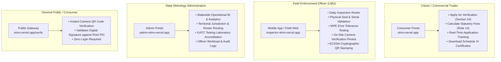
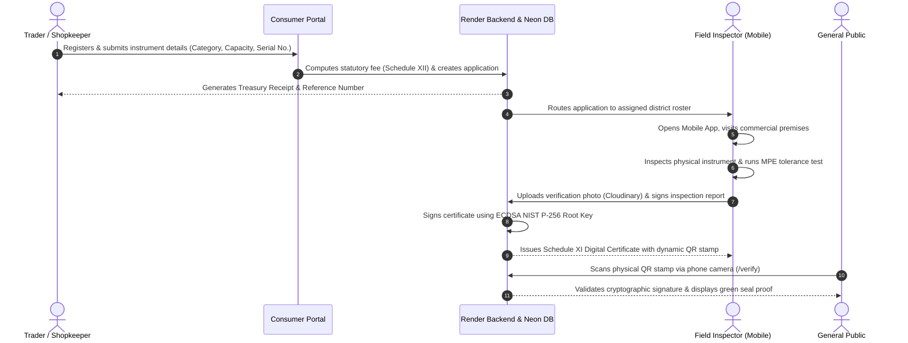

# eLMV — Online Verification System for Weighing & Measuring Instruments

Unified statutory verification, certification, and regulatory tracking system under India's **Legal Metrology Act, 2009** (Act No. 1 of 2010) and **Legal Metrology (General) Rules, 2011**.

[](https://elmv.vercel.app)
[](https://sih26-wfjr.onrender.com/health)
[](https://neon.tech)
[](https://expo.dev/accounts/sumitbudaniya/projects/elmv/builds/8baa9ca1-0f51-42c0-9c47-8ae72baf12cc)

---

## 🌐 Live Production Deployments

All components are deployed and accessible online:

| Component | Target Users | Live Production URL | Infrastructure |
| :--- | :--- | :--- | :---: |
| **Consumer & Trader Portal** | Citizens, Shopkeepers, Commercial Traders | **[https://elmv.vercel.app](https://elmv.vercel.app)** | Vercel |
| **Admin Management Portal** | State Controllers, Metrology Directors, GATC Admin | **[https://admin-elmv.vercel.app](https://admin-elmv.vercel.app)** | Vercel |
| **Field Inspection Suite** | Legal Metrology Officers (LMOs), Field Inspectors | **[https://inspector-elmv.vercel.app](https://inspector-elmv.vercel.app)** | Vercel |
| **Public QR Certificate Verification** | Any Citizen scanning physical QR code stamps | **[https://elmv.vercel.app/verify](https://elmv.vercel.app/verify)** | Vercel |
| **Backend REST API Engine** | Business Logic, PKI Cryptography, Auth | **[https://sih26-wfjr.onrender.com/api/v1](https://sih26-wfjr.onrender.com/api/v1)** | Render |
| **Server Health & Monitoring** | 24/7 Automated Keep-Alive Endpoint | **[https://sih26-wfjr.onrender.com/health](https://sih26-wfjr.onrender.com/health)** | Render |
| **Mobile Android App (APK)** | Field Enforcement Officers on Android | **[Download APK v1.0.0](https://expo.dev/accounts/sumitbudaniya/projects/elmv/builds/8baa9ca1-0f51-42c0-9c47-8ae72baf12cc)** | Expo EAS |

---

## 🎯 Portals, Uses & Target Personas



---

## 📖 How to Use the System (End-to-End Workflow)

The system digitizes the entire lifecycle of weighing and measuring instruments from application to digital stamping:



### 1. For Commercial Traders & Instrument Owners
1. Visit **[https://elmv.vercel.app](https://elmv.vercel.app)**.
2. Sign in or register as a commercial entity (Trader).
3. Open **"Apply for Stamping"**:
   * Select instrument category (e.g. *NAWI Class II High Precision*, *NAWI Class III Counter Scale*, *Electronic Weighbridge*, *Fuel Dispenser*).
   * Enter make, model, capacity, and serial number.
4. The statutory fee calculator automatically computes the fee per **Rule 14 / Schedule XII**.
5. Submit the application to generate an official **Treasury Reference Number**.
6. Track real-time progress (`SUBMITTED → SCHEDULED → INSPECTED → CERTIFIED`) from the dashboard.

### 2. For Legal Metrology Officers (Field Inspectors)
1. Open the **eLMV Mobile App** on Android (or visit **[https://inspector-elmv.vercel.app](https://inspector-elmv.vercel.app)**).
2. Log in with officer credentials.
3. Access the **Inspection Roster**:
   * View scheduled on-site inspections assigned to your territorial jurisdiction.
   * View trader premises address, contact, and instrument specifications.
4. Conduct physical verification:
   * Test accuracy against standard working weights and verify **Maximum Permissible Error (MPE)**.
   * Verify lead/wire physical security seals.
   * Capture an on-site verification photo with the device camera.
5. Tap **"Verify & Issue Certificate"**:
   * The server cryptographically signs the inspection record with the government ECDSA private key.
   * A verifiable **Schedule XI Digital Certificate** and QR code are instantly generated.

### 3. For State Controllers & Metrology Administrators
1. Visit **[https://admin-elmv.vercel.app](https://admin-elmv.vercel.app)**.
2. Log in with administrative credentials.
3. Review statewide compliance:
   * **Analytics & BI**: Turnaround times (TAT), regional compliance rates, revenue reconciliation.
   * **Officer Management**: Rebalance workload across districts and enforcement zones.
   * **Agency Management**: Approve, monitor, and audit accredited Government Approved Test Centres (GATC).
   * **Audit Log**: Immutable ledger of all administrative and enforcement actions.

### 4. For Citizens & Consumers (Public Stamping Verification)
1. Point any smartphone camera at the QR code printed on the physical weighing scale or metrology certificate.
2. The browser directly opens **[https://elmv.vercel.app/verify](https://elmv.vercel.app/verify)**.
3. The server cryptographically validates the token digest against the state's public ECDSA key.
4. The screen displays the official green verification seal, instrument serial number, issuing officer, validity period, and statutory certificate with zero login required.

---

## 🏗️ Technical Architecture & Monorepo Structure

```
/
├── shared/                  # @sih/shared
│   ├── src/schemas/         # Zod statutory validation schemas (auth, instrument, inspection, certificate)
│   ├── src/types/           # TypeScript interfaces, API response envelopes, role enums
│   └── src/constants/       # Statutory fee tables (Schedule XII), MPE error limits
│
├── server/                  # @sih/server (Express & Node.js)
│   ├── prisma/              # Multi-tenant PostgreSQL database schema & migrations
│   ├── src/keys/            # PKI ECDSA NIST P-256 key management & AES-256-GCM encryption
│   ├── src/middleware/      # JWT authentication, role guards, CORS policy
│   ├── src/modules/         # Modular domain services (auth, instruments, verification, certificates, gatc)
│   └── src/config/          # Zod-validated environment config, Cloudinary CDN, Winston logger
│
├── client/                  # @sih/client (React 18 & Vite SPA)
│   ├── src/portals/
│   │   ├── consumer/        # Citizen & Trader portal workspace
│   │   ├── admin/           # Controller & Governance dashboard
│   │   └── field/           # Field Officer mobile-responsive workspace
│   ├── src/features/        # Shared domain UI (verification scanner, analytics, audit log)
│   ├── src/lib/             # Subdomain & domain isolation router, Axios interceptors
│   └── src/i18n/            # Full bilingual localization (English & हिन्दी)
│
└── mobile/                  # @sih/mobile (React Native & Expo)
    ├── src/screens/         # Roster list, inspection HUD, Schedule XI certificate viewer
    ├── src/lib/             # Hardware-backed token storage (expo-secure-store), API client
    ├── assets/              # Native launcher icons, adaptive icons, Ashok Stambh emblems
    └── eas.json             # EAS cloud build profiles for standalone APK distribution
```

---

## 🔒 Deep Technical Specifications

### 1. Asymmetric PKI Digital Signatures (ECDSA NIST P-256 / SHA-256)
* Every verification certificate is cryptographically signed using the **ECDSA NIST P-256** (`prime256v1`) elliptic curve algorithm with SHA-256 (FIPS 186-4 compliant).
* Deterministic JSON canonicalization guarantees byte-reproducible digests across heterogeneous platforms.
* Private signing keys are encrypted at rest using **AES-256-GCM** with unique initialization vectors.
* Public keys are exposed via a standard JWKS-style endpoint for third-party automated validation.

### 2. Mobile Enforcement Suite (`@sih/mobile`)
* Built with **React Native** and **Expo SDK 52**.
* **Hardware-Backed Cryptographic Security**: Session tokens are isolated using `expo-secure-store` backed by the **Android Keystore System** (hardware TEE) and **Apple iOS Keychain** (Secure Enclave).
* **Native Camera HUD**: Low-latency QR scanner with real-time target reticles, torch control, and direct-to-drawer inspection record display.
* **Offline Fallback Queue**: Local inspection caching allows officers in remote rural zones without connectivity to complete checklists and sync when network access resumes.

### 3. Statutory MPE Tolerance Engine
* Automatically validates user readings against the **Maximum Permissible Error (MPE)** tolerances specified in the Legal Metrology (General) Rules, 2011:
  * **Class I (Special)**: High precision micro-balances.
  * **Class II (High)**: Jewellery and gold weighing instruments.
  * **Class III (Medium)**: Commercial retail counter and platform scales.
  * **Class IIII (Ordinary)**: Industrial weighing systems and weighbridges.
* Rejects certification automatically if observed error exceeds statutory tolerance.

### 4. Rule 14 & Section 24 Automated Compliance
* **Schedule XII Fee Computation**: Calculates verification fees based on instrument capacity and category automatically.
* **Treasury Receipt Engine**: Generates unique treasury reference numbers (`REC-YYYY-XXXXXX`) for state audit reconciliation.
* **Section 24 Proactive Expiry Monitoring**: Automatic daily background cron flags instruments due for re-verification within 30 days.

---

## 🛠️ Local Development Quick Start

### Prerequisites
* **Node.js** >= 18.0.0
* **npm** >= 9.0.0
* **Docker** (optional, for local PostgreSQL)

### 1. Clone & Install
```bash
git clone https://github.com/sumitbudaniyaa/eLMV.git
cd eLMV
npm install
```

### 2. Environment Configuration
Create a `.env` file in the `server` directory (or use `.env.example` as a template):
```bash
cp server/.env.example server/.env
```

### 3. Start All Services Concurrently
Run backend, all 3 web portals, and the mobile bundler with a single command:
```bash
npm run dev
```

### Local Workspace Ports:
* **Consumer Web**: `http://localhost:5173`
* **Admin Management**: `http://localhost:5174`
* **Field Officer Suite**: `http://localhost:5175`
* **Backend REST API**: `http://localhost:5001/api/v1`
* **Mobile Metro Bundler**: `http://localhost:8081`

---

## 📜 License
Developed for the **Smart India Hackathon (SIH)** — Online Verification System for Weighing & Measuring Instruments under India Legal Metrology Act.
